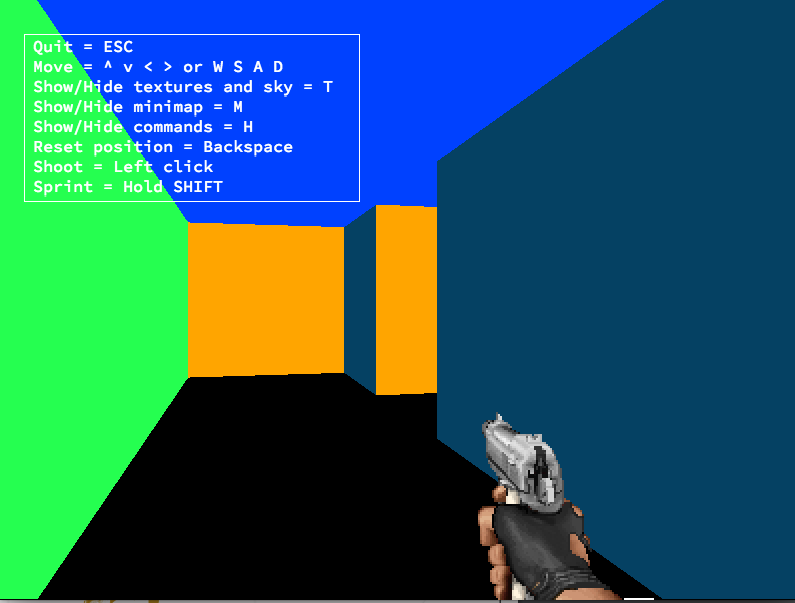
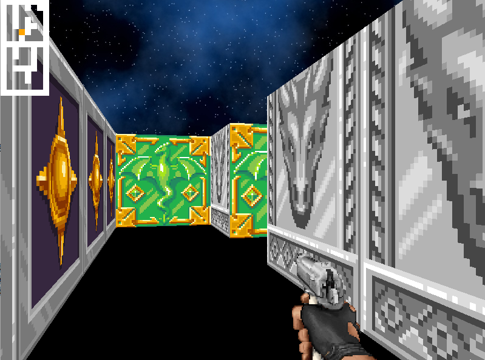
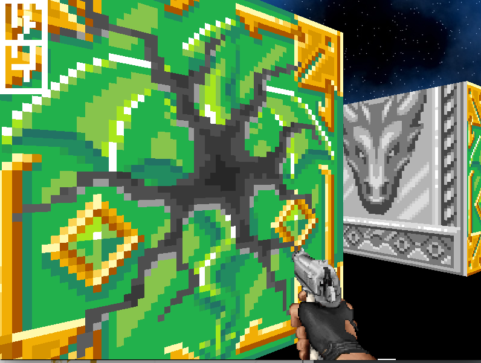

# wolf3d

Inspiré du célèbre jeu éponyme des années 90 qui fut le premier First Person Shooter, ce projet permet d’aborder la technique du ray-casting.
Le but est de représenter une vue dynamique à l’intérieur d’un labyrinthe dans lequel on peut se déplacer.

